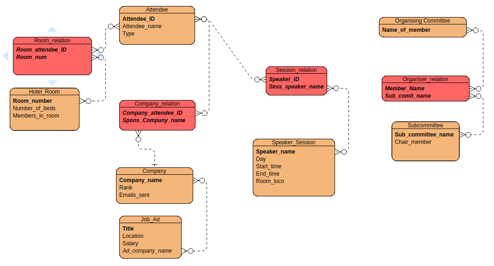

# CMPE 332 Final Report - Assumptions, ER-Schema, Discussion and User Guide
## Max Gillham
## Noah Rottman 

### Assumptions made
* The room numbers are at most 3 digits, integers, and unique numbers
* There is only one chair member for each sub_committee
* The speakers have unique names
* The members of the organising committe have unique names
### ER Schema
Here is the ER schema design for the database.

 
The script to create this database and populate it with some sample information is included in the submission named `Conference.sql`.  

### Discussion
#### Problems encountered during devolopment and how they were solved.
During the devolopment of this project we encountered numberous obsticals.  
 
 
One of the functionality requirements we struggled with was adding a student attendee. What caused the challange here was the number of cases to check for when adding a student to a hotel room. In our implementation, when an attendee is added, the we must check if their attendee ID entered is not currently in use.  After doing so, then we check if the attendee is of type student.  If we have a student to add to a hotel room, we must first run a query to count the number students in each hotel room by joining hotel_room.room_number with room_rel.room_num and counting by grouping by the `room_numb` attribute and returning the rows where this count is strictly less than the number of beds in the room. That is, we check out of the currently occupied rooms, what rooms have atleast one extra bed.  If this query returns no tupples, then we check if there are any empty rooms available and add the student to that room, or return a messege to the orgranizer that they must book more rooms.  This ensures that the rooms are all entirely filled up, not allowing empty spots in any rooms, unless that room is completely unused.
 
Another problem encountered was entering the times for sessions. The problem arose because the database we orginally designed inputed characters for this feild, but we didn't want to use a text box becuase then users could enter any random string as a time and that didn't reflect well in the database.  The solution was to use the time input in the html form, which returned a string, however, forced users to enter a valid time.
 
Another problem encountered was deleting a sponsoring company and respective employees. For our implementation, this ment deleting the company from the `company` table, then removing all entries in the `company_relation` and `attendee` table associated with that company. To combat this series of steps we run two sequential sql queries when this post request is made, the first being to remove the company from the `company` table and the following being a deletion of entries in the inner join of `company_rel` and `attendees` where the company name corresponded to the name given in the body of the post request.
#### Important Design and Implementation Decisions
The webapp is built like a tree structure where `conference.html` is the root node. This page is the homepage for the application. Each functionality option is built into this page for the user to navigate and control. When a request is made, a php script is called.  These scripts are not unique for each request, however, are divided with repect to the areas of the database they encounter. 
All post and get requests made on the website are through html forms. This is usefull as we can specify the datatype of the input to ensure it is consistent with the database. In addition, this is useful as we can easily assign id's to the requests and to each input paramater in the body of the post request so it is easily parsed by the php script.
 
Another design used was PDO objects.  This allowed us to pre-format sql queries and insert requered parameters for the `WHERE` clauses and so on.  
#### Technologies Used for Devolopment
The webapp is built using html, css and php.  The `conference.html` consists of lots of form type inputs to be easily handled by the php scripts.  The css file is used to make the website look nice and be easy to use.  The php scripts are used to execute sql queries on the database and render in results.  
 
This webapp was compiled, devoloped and designed using the xampp enviorment.  This was convient as we could easily access our database as they were hosted locally on the same server. Xampp also supports rendering of static webpages and can compile php scripts.
#### Things to Change for Future Considerations
For a further implementation it would be usefull to implement syntax checking for all of the inputs. This implementation only checks to make sure feilds are non empty. In addition, it would be usefull to check for inputs that embed sql queries to avoid injection attacks. Also, the session times are not consistent as a user can add conflicting times (ending before starting). This is something that could be included in checking inputes.  There are also situations where switch cases may have been more effective than chained else if statements, or at the very least, easier to read.  
### User Guide
